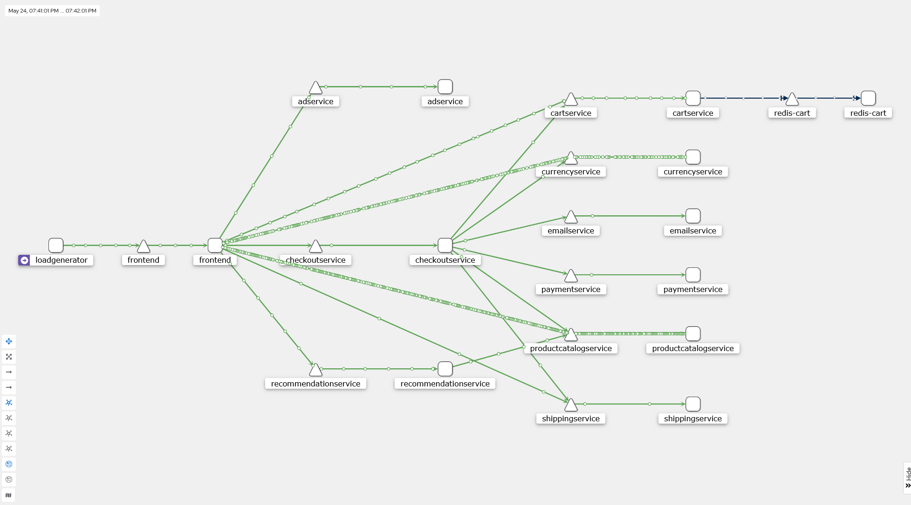

# Lab: Service Mesh

**Name:** Robert Mesek  
**Lab:** 4  
**Date:** May 24, 2026

---

## Task -1 – Prepare and Verify your environment

```powershell
> kubectl get nodes
NAME                            STATUS   ROLES    AGE     VERSION
ip-172-31-2-250.ec2.internal    Ready    <none>   2m39s   v1.35.5-eks-3385e9b
ip-172-31-32-161.ec2.internal   Ready    <none>   2m38s   v1.35.5-eks-3385e9b
```

```powershell
> kubectl --namespace kube-system get pods
NAME                              READY   STATUS    RESTARTS      AGE
aws-node-lvc5q                    2/2     Running   0             88s
aws-node-zx9m8                    2/2     Running   0             88s
coredns-7fc5967d79-6m9q6          1/1     Running   0             58s
coredns-7fc5967d79-t6x5z          1/1     Running   0             58s
eks-node-monitoring-agent-597kg   1/1     Running   2 (53s ago)   3m8s
eks-node-monitoring-agent-mbksd   1/1     Running   2 (53s ago)   3m9s
eks-pod-identity-agent-5dvtb      1/1     Running   0             59s
eks-pod-identity-agent-zr49f      1/1     Running   0             58s
kube-proxy-jknvt                  1/1     Running   0             56s
kube-proxy-l4kkq                  1/1     Running   0             56s
metrics-server-b8c45bcb8-4kpzg    1/1     Running   1 (44s ago)   4m42s
metrics-server-b8c45bcb8-gbq5d    1/1     Running   1 (44s ago)   4m42s
```

## Task 0 – Install Istio Control Plane

```powershell
> kubectl -n istio-system get pods
NAME                                    READY   STATUS    RESTARTS   AGE
istio-egressgateway-64d76c9487-b9brh    1/1     Running   0          63s
istio-ingressgateway-7c4fcf8489-wfdfh   1/1     Running   0          63s
istiod-6ffcf45f8b-xjnsb                 1/1     Running   0          75s
```

```powershell
> kubectl -n istio-system get svc
NAME                          TYPE           CLUSTER-IP       EXTERNAL-IP                                                              PORT(S)                                                                      AGE
istio-egressgateway           ClusterIP      10.100.141.251   <none>                                                                   80/TCP,443/TCP                                                               84s
istio-ingressgateway          LoadBalancer   10.100.8.69      a32f99e6bb7fe40e8a83241aca41ac9c-511683434.us-east-1.elb.amazonaws.com   15021:31302/TCP,80:31322/TCP,443:30301/TCP,31400:32579/TCP,15443:31973/TCP   84s
istiod                        ClusterIP      10.100.128.79    <none>                                                                   15010/TCP,15012/TCP,443/TCP,15014/TCP                                        96s
istiod-revision-tag-default   ClusterIP      10.100.183.253   <none>                                                                   15010/TCP,15012/TCP,443/TCP,15014/TCP                                        68s
```

```powershell
> kubectl -n istio-system get svc istio-ingressgateway
NAME                   TYPE           CLUSTER-IP    EXTERNAL-IP                                                              PORT(S)                                                                      AGE
istio-ingressgateway   LoadBalancer   10.100.8.69   a32f99e6bb7fe40e8a83241aca41ac9c-511683434.us-east-1.elb.amazonaws.com   15021:31302/TCP,80:31322/TCP,443:30301/TCP,31400:32579/TCP,15443:31973/TCP   119s
```

## Task 1 – Deploy test application

```powershell
> kubectl -n default get pods
NAME                                        READY   STATUS    RESTARTS      AGE
adservice-v1-565cfbcd84-dgjmk               2/2     Running   0             63s
cartservice-v1-565f7849cf-7vrl4             2/2     Running   2 (49s ago)   68s
checkoutservice-v1-84dd58c487-7sqs6         2/2     Running   0             74s
currencyservice-v1-9c7bc475-7td2w           2/2     Running   0             67s
emailservice-v1-cbb949b65-psch5             2/2     Running   0             75s
emailservice-v2-7cccbc555b-577k6            2/2     Running   0             75s
frontend-v1-777cb949cc-ktv6k                2/2     Running   0             72s
loadgenerator-549975cd77-s7tll              2/2     Running   3 (27s ago)   67s
paymentservice-v1-6bfb64b4b8-t2r47          2/2     Running   0             71s
productcatalogservice-v1-b9c85f4b9-zmtjc    2/2     Running   0             70s
productcatalogservice-v2-6d6bf7bd86-qwgjl   2/2     Running   0             69s
recommendationservice-v1-755664dd9f-f9sw2   2/2     Running   0             73s
redis-cart-v1-664db6988f-7r5j9              2/2     Running   0             63s
shippingservice-v1-868c485955-b2mhj         2/2     Running   0             66s
shippingservice-v2-696b876748-7rw8q         2/2     Running   0             65s
shippingservice-v3-569458c949-ztx7z         2/2     Running   0             65s
```

## Task 2 – Observability, service metrics

1. How many ops are being currently processed by the application?  
  * 33.1 ops/s
2. What is the global success rate?
  * 100%
3. Are there any request errors occurring in the application at the moment? How do you
check that?
  * 0 ops/s (4xxs + 5xxs)
4. Which application service processes the most requests? What is its p99 latency and suc-
cess rate?
  * currencyservice.default.svc.cluster.local (4.84 ms, 100.00%)
5. What is the current CPU and memory usage by Istio Pilot?
  * 131 MiB Resident Memory
  * 0.00227 CPU Discovery (container)
6. Does Istio Pilot encouteres any errors at the moment?
  * 0 Pilot Errors

## Task 3 – Observability, distributed tracing
There is only `jaeger-query` in Service dropdown.
1. When the request started (date, time)?
  * Today, 6:38:11 pm
2. Total request duration?
  * 2.07ms
3. Request protocol, method and status code?
  * Protocol: HTTP (`net/http` component)
  * Method: GET
  * Status Code: 200
4. Duration of nested span?
  * No nested spans

## Task 4 – Observability, mesh topology



1. Is the inter-service communication healthy? How do you check that?
  * Yes, all connections are green
2. What is the entry-point service of the application?
  * `frontend` service
3. Which services communicate with the currency service?
  * `frontend`, `checkoutservice`
4. Which services communicate with the productcatalog service?
  * `frontend`, `checkoutservice`, `recommendationservice`
5. Which services does the checkout service communicate with?
  * `cartservice`, `currencyservice`, `emailservice`, `paymentservice`, `productcatalogservice`, `shippingservice`
6. What is the request volume (ops) for currency service? What are its success and error rates?
  * RPS: 7.07 (100.00% Success, 0.00% Errors)
7. What is the request volume (ops) for payment service? What are its success and error rates?
  * RPS: 0.13 (100.00% Success, 0.00% Errors)
8. What protocol is used on the communication path between the frontend and the recommendation service?
  * grpc
9. What protocol is used on the communication path between the cart service and the redis service?
  * tcp

## Task 5 – Traffic management, ingress gateway
