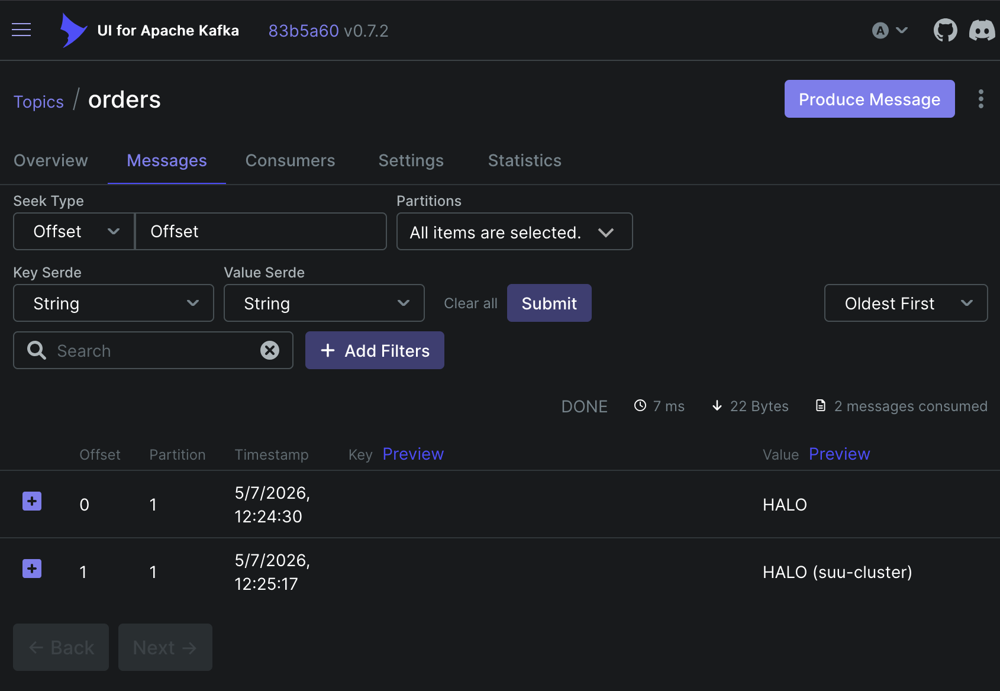
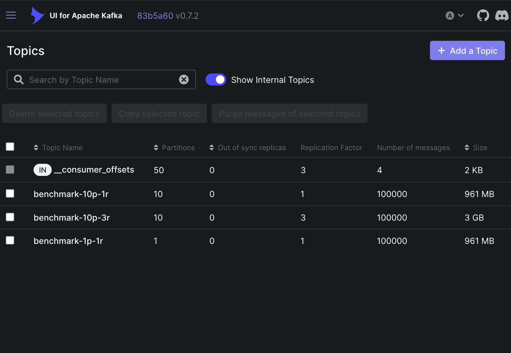

# Lab: Data Streaming

**Name:** Robert Mesek  
**Lab:** 5  
**Date:** May 7, 2026

---

## TASK -1 – list all nodes and components in your kube-system namespace

```zsh
% kubectl get nodes
NAME                            STATUS   ROLES    AGE     VERSION
ip-172-31-15-203.ec2.internal   Ready    <none>   2m29s   v1.35.4-eks-40737a8
ip-172-31-35-15.ec2.internal    Ready    <none>   2m23s   v1.35.4-eks-40737a8
ip-172-31-35-23.ec2.internal    Ready    <none>   2m27s   v1.35.4-eks-40737a8
```

```zsh
% kubectl --namespace kube-system get pods
NAME                              READY   STATUS    RESTARTS   AGE
aws-node-6kdnp                    2/2     Running   0          2m43s
aws-node-pvqkd                    2/2     Running   0          2m47s
aws-node-xtxf4                    2/2     Running   0          2m49s
coredns-7fc5967d79-68prt          1/1     Running   0          15m
coredns-7fc5967d79-lfz2b          1/1     Running   0          15m
eks-node-monitoring-agent-b6bsw   1/1     Running   0          2m43s
eks-node-monitoring-agent-kbtl9   1/1     Running   0          2m47s
eks-node-monitoring-agent-ngwfg   1/1     Running   0          2m49s
eks-pod-identity-agent-8rlm9      1/1     Running   0          2m49s
eks-pod-identity-agent-dm6sv      1/1     Running   0          2m43s
eks-pod-identity-agent-qvqbj      1/1     Running   0          2m47s
kube-proxy-j2lvc                  1/1     Running   0          2m43s
kube-proxy-rn4wh                  1/1     Running   0          2m49s
kube-proxy-sc72f                  1/1     Running   0          2m47s
metrics-server-b8c45bcb8-mwr2z    1/1     Running   0          14m
metrics-server-b8c45bcb8-q5lpg    1/1     Running   0          14m
```

## Task 0 – Strimzi Kafka Operator

```zsh
% kubectl get pods -n suu-kafka
NAME                                                 READY   STATUS    RESTARTS   AGE
strimzi-cluster-operator-57856f5f9b-fmjw4            1/1     Running   0          2m1s
suu-kafka-cluster-dual-role-0                        1/1     Running   0          73s
suu-kafka-cluster-dual-role-1                        1/1     Running   0          73s
suu-kafka-cluster-dual-role-2                        1/1     Running   0          73s
suu-kafka-cluster-entity-operator-7789d8f8f5-x9phv   2/2     Running   0          24s
```

## Task 1 – Creating topics



## Task 2 – Partitions and replication



```zsh
% kubectl exec -n suu-kafka -it kafka-client -- \
bin/kafka-producer-perf-test.sh \
--num-records 100000 \
--record-size 10000 \
--throughput -1 \
--topic benchmark-1p-1r  \
--producer-props \
bootstrap.servers=suu-kafka-cluster-kafka-bootstrap:9092
Option --producer-props has been deprecated and will be removed in a future version. Use --command-property instead.
3010 records sent, 602.0 records/sec (5.74 MB/sec), 2068.8 ms avg latency, 2927.0 ms max latency.
5209 records sent, 1041.8 records/sec (9.94 MB/sec), 2048.9 ms avg latency, 2480.0 ms max latency.
8440 records sent, 1687.7 records/sec (16.09 MB/sec), 1274.9 ms avg latency, 1782.0 ms max latency.
18471 records sent, 3694.2 records/sec (35.23 MB/sec), 581.4 ms avg latency, 1039.0 ms max latency.
19378 records sent, 3874.1 records/sec (36.95 MB/sec), 527.5 ms avg latency, 705.0 ms max latency.
20890 records sent, 4178.0 records/sec (39.84 MB/sec), 487.5 ms avg latency, 694.0 ms max latency.
18943 records sent, 3788.6 records/sec (36.13 MB/sec), 545.1 ms avg latency, 798.0 ms max latency.
100000 records sent, 2746.875429 records/sec (26.20 MB/sec), 719.88 ms avg latency, 2927.00 ms max latency, 524 ms 50th, 1926 ms 95th, 2475 ms 99th, 2877 ms 99.9th.
```

```zsh
% kubectl exec -n suu-kafka -it kafka-client -- \
bin/kafka-producer-perf-test.sh \
--num-records 100000 \
--record-size 10000 \
--throughput -1 \
--topic benchmark-10p-1r  \
--producer-props \
bootstrap.servers=suu-kafka-cluster-kafka-bootstrap:9092
Option --producer-props has been deprecated and will be removed in a future version. Use --command-property instead.
8637 records sent, 1727.1 records/sec (16.47 MB/sec), 466.7 ms avg latency, 820.0 ms max latency.
19120 records sent, 3823.2 records/sec (36.46 MB/sec), 521.3 ms avg latency, 980.0 ms max latency.
25779 records sent, 5155.8 records/sec (49.17 MB/sec), 289.5 ms avg latency, 826.0 ms max latency.
28681 records sent, 5736.2 records/sec (54.70 MB/sec), 201.7 ms avg latency, 588.0 ms max latency.
100000 records sent, 4344.237369 records/sec (41.43 MB/sec), 288.86 ms avg latency, 980.00 ms max latency, 250 ms 50th, 614 ms 95th, 842 ms 99th, 920 ms 99.9th.
```

```zsh
% kubectl exec -n suu-kafka -it kafka-client -- \
bin/kafka-producer-perf-test.sh \
--num-records 100000 \
--record-size 10000 \
--throughput -1 \
--topic benchmark-10p-3r  \
--producer-props \
bootstrap.servers=suu-kafka-cluster-kafka-bootstrap:9092
Option --producer-props has been deprecated and will be removed in a future version. Use --command-property instead.
2833 records sent, 565.4 records/sec (5.39 MB/sec), 863.6 ms avg latency, 2208.0 ms max latency.
5306 records sent, 1061.2 records/sec (10.12 MB/sec), 2022.7 ms avg latency, 3272.0 ms max latency.
6042 records sent, 1206.2 records/sec (11.50 MB/sec), 1663.4 ms avg latency, 2862.0 ms max latency.
6566 records sent, 1311.4 records/sec (12.51 MB/sec), 1654.7 ms avg latency, 2533.0 ms max latency.
8049 records sent, 1609.8 records/sec (15.35 MB/sec), 1343.6 ms avg latency, 2170.0 ms max latency.
10202 records sent, 2040.4 records/sec (19.46 MB/sec), 1020.7 ms avg latency, 1697.0 ms max latency.
11363 records sent, 2272.6 records/sec (21.67 MB/sec), 927.0 ms avg latency, 1439.0 ms max latency.
9823 records sent, 1964.6 records/sec (18.74 MB/sec), 1002.3 ms avg latency, 1751.0 ms max latency.
12303 records sent, 2460.6 records/sec (23.47 MB/sec), 863.0 ms avg latency, 1542.0 ms max latency.
11778 records sent, 2355.1 records/sec (22.46 MB/sec), 839.1 ms avg latency, 1250.0 ms max latency.
12440 records sent, 2488.0 records/sec (23.73 MB/sec), 857.0 ms avg latency, 1311.0 ms max latency.
100000 records sent, 1763.046544 records/sec (16.81 MB/sec), 1096.67 ms avg latency, 3272.00 ms max latency, 1009 ms 50th, 2218 ms 95th, 2810 ms 99th, 3039 ms 99.9th.
```

## Task 3 – Kafka API

```python
# /// script
# dependencies = [
#   "confluent-kafka",
# ]
# ///


from confluent_kafka import Consumer, KafkaError

# Configuration for the Consumer
conf = {
    "bootstrap.servers": "a8e72c2937e304e3986bb09de8dd450b-405726189.us-east-1.elb.amazonaws.com:9094",
    "group.id": "order-consumers",
    "auto.offset.reset": "earliest",
}

consumer = Consumer(conf)
consumer.subscribe(["orders"])  # Consumes from the 'orders' topic

try:
    print("Waiting for messages... Press Ctrl+C to stop.")
    while True:
        msg = consumer.poll(1.0)  # Timeout of 1 second
        if msg is None:
            continue
        if msg.error():
            print(f"Consumer error: {msg.error()}")
            continue

        # Observe how messages are distributed among partitions
        print(
            f"Key: {msg.key().decode('utf-8')} | "
            f"Partition: {msg.partition()} | "
            f"Value: {msg.value().decode('utf-8')}"
        )

except KeyboardInterrupt:
    pass
finally:
    consumer.close()
```

```zsh
% uv run Consumer.py
Waiting for messages... Press Ctrl+C to stop.
Key: user_1 | Partition: 2 | Value: {"order_id": 6001, "user": "Alice", "item": "Keyboard"}
Key: user_1 | Partition: 2 | Value: {"order_id": 8108, "user": "Alice", "item": "Keyboard"}
Key: user_1 | Partition: 2 | Value: {"order_id": 9898, "user": "Alice", "item": "Keyboard"}
Key: user_1 | Partition: 2 | Value: {"order_id": 5493, "user": "Alice", "item": "Monitor"}
Key: user_2 | Partition: 2 | Value: {"order_id": 8023, "user": "Bob", "item": "Mouse"}
Key: user_2 | Partition: 2 | Value: {"order_id": 1656, "user": "Bob", "item": "Mouse"}
Key: user_2 | Partition: 2 | Value: {"order_id": 5125, "user": "Bob", "item": "Monitor"}
Key: user_2 | Partition: 2 | Value: {"order_id": 2845, "user": "Bob", "item": "Laptop"}
Key: user_3 | Partition: 1 | Value: {"order_id": 2027, "user": "Charlie", "item": "Monitor"}
Key: user_3 | Partition: 1 | Value: {"order_id": 9003, "user": "Charlie", "item": "Monitor"}
Key: user_3 | Partition: 1 | Value: {"order_id": 7937, "user": "Charlie", "item": "Mouse"}
Key: user_3 | Partition: 1 | Value: {"order_id": 5564, "user": "Charlie", "item": "Mouse"}
Key: user_4 | Partition: 1 | Value: {"order_id": 5633, "user": "Diana", "item": "Monitor"}
Key: user_4 | Partition: 1 | Value: {"order_id": 9441, "user": "Diana", "item": "Mouse"}
Key: user_4 | Partition: 1 | Value: {"order_id": 4813, "user": "Diana", "item": "Keyboard"}
Key: user_4 | Partition: 1 | Value: {"order_id": 2340, "user": "Diana", "item": "Keyboard"}
Key: user_4 | Partition: 1 | Value: {"order_id": 3133, "user": "Diana", "item": "Keyboard"}
```

```python
# /// script
# dependencies = [
#   "requests",
#   "rich",
#   "confluent-kafka",
# ]
# ///

import requests
from rich.pretty import pprint

resp = requests.get("https://peps.python.org/api/peps.json")
data = resp.json()
pprint([(k, v["title"]) for k, v in data.items()][:10])

from confluent_kafka import Producer
import random
import json

# Configuration for the Producer
conf = {
    "bootstrap.servers": "a8e72c2937e304e3986bb09de8dd450b-405726189.us-east-1.elb.amazonaws.com:9094",
    "client.id": "python-producer",
}

producer = Producer(conf)
topic = "orders"

# List of people who can make an order
people = [
    {"id": "user_1", "name": "Alice"},
    {"id": "user_2", "name": "Bob"},
    {"id": "user_3", "name": "Charlie"},
    {"id": "user_4", "name": "Diana"},
]


def delivery_report(err, msg):
    if err is not None:
        print(f"Message delivery failed: {err}")
    else:
        print(
            f"Message delivered to {msg.topic()} [{msg.partition()}] at offset {msg.offset()}"
        )


# Generate random orders for each person
for person in people:
    num_orders = random.randint(1, 5)
    for i in range(num_orders):
        order_data = {
            "order_id": random.randint(1000, 9999),
            "user": person["name"],
            "item": random.choice(["Laptop", "Mouse", "Keyboard", "Monitor"]),
        }

        # Produce the order using the Person ID as the KEY
        producer.produce(
            topic,
            key=person["id"],
            value=json.dumps(order_data),
            callback=delivery_report,
        )

producer.flush()  # Wait for all messages to be delivered
```

```zsh
% uv run Producer.py
[
│   ('1', 'PEP Purpose and Guidelines'),
│   ('2', 'Procedure for Adding New Modules'),
│   ('3', 'Guidelines for Handling Bug Reports'),
│   ('4', 'Deprecation of Standard Modules'),
│   ('5', 'Guidelines for Language Evolution'),
│   ('6', 'Bug Fix Releases'),
│   ('7', 'Style Guide for C Code'),
│   ('8', 'Style Guide for Python Code'),
│   ('9', 'Sample Plaintext PEP Template'),
│   ('10', 'Voting Guidelines')
]
Message delivered to orders [2] at offset 7
Message delivered to orders [2] at offset 8
Message delivered to orders [2] at offset 9
Message delivered to orders [2] at offset 10
Message delivered to orders [2] at offset 11
Message delivered to orders [2] at offset 12
Message delivered to orders [2] at offset 13
Message delivered to orders [2] at offset 14
Message delivered to orders [1] at offset 7
Message delivered to orders [1] at offset 8
Message delivered to orders [1] at offset 9
Message delivered to orders [1] at offset 10
Message delivered to orders [1] at offset 11
Message delivered to orders [1] at offset 12
Message delivered to orders [1] at offset 13
Message delivered to orders [1] at offset 14
Message delivered to orders [1] at offset 15
```