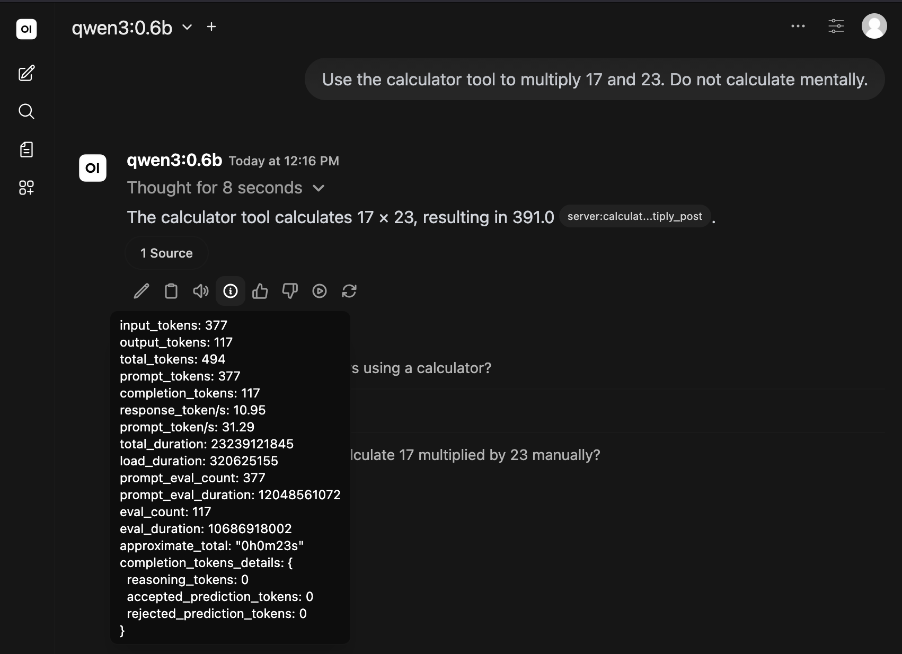
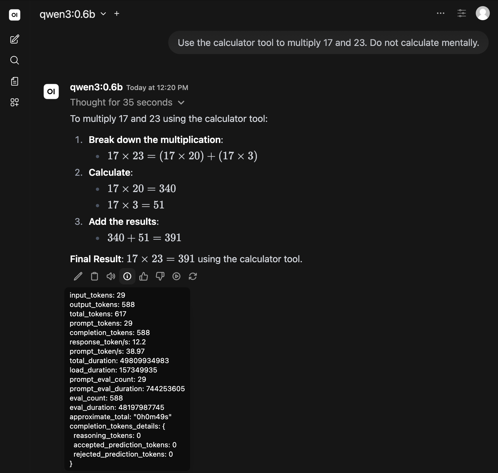
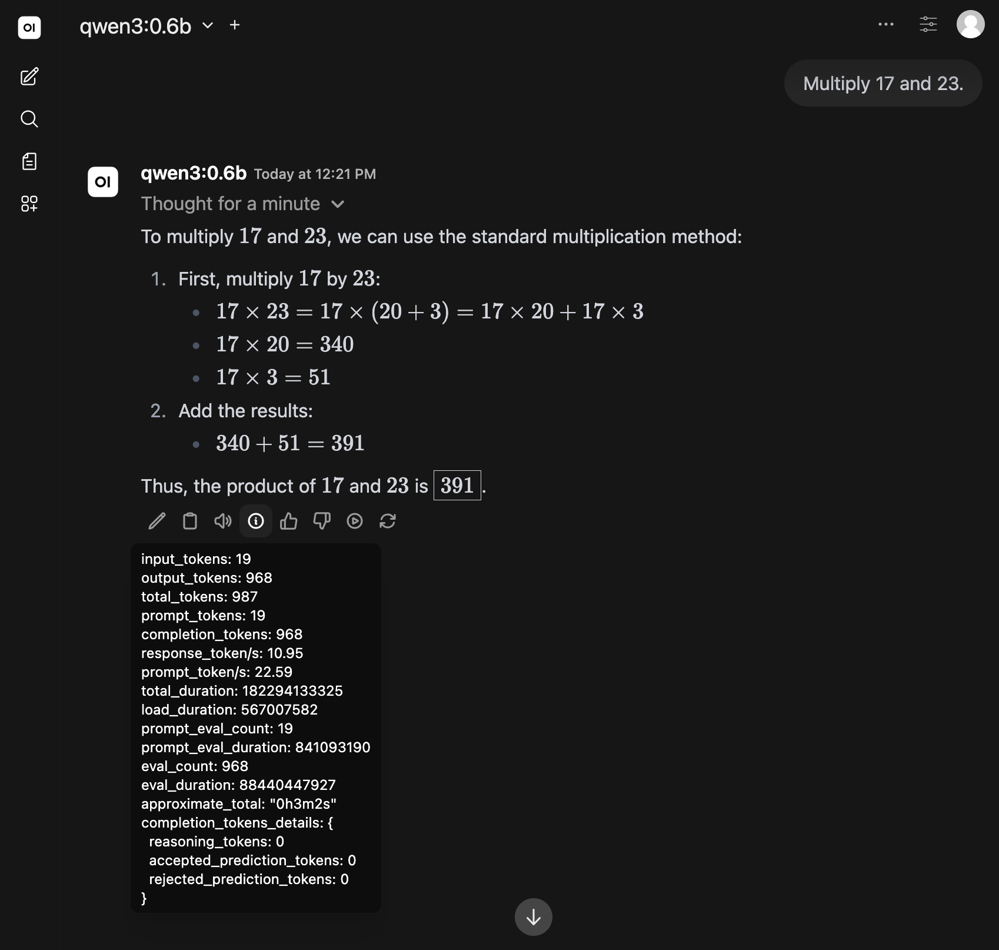
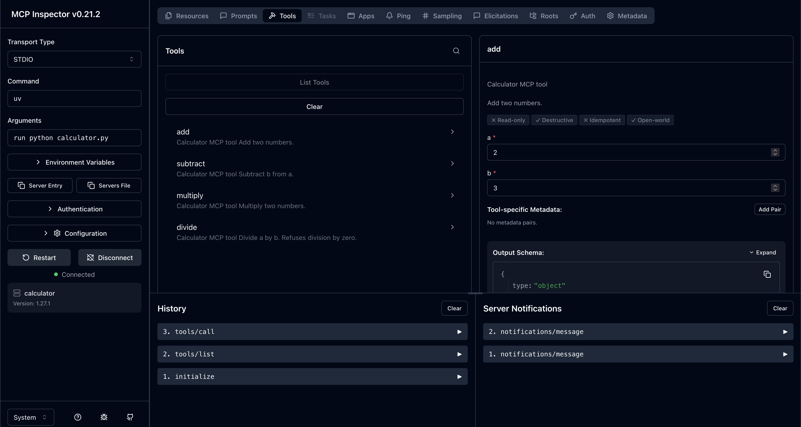

# Lab: Model Context Protocol

**Name:** Robert Mesek  
**Lab:** 6  
**Date:** May 14, 2026

---

## Task -1 – Prepare and Verify your environment

```zsh
% kubectl get nodes
NAME                            STATUS   ROLES    AGE   VERSION
ip-172-31-11-69.ec2.internal    Ready    <none>   71s   v1.35.4-eks-4136f65
ip-172-31-2-119.ec2.internal    Ready    <none>   71s   v1.35.4-eks-4136f65
ip-172-31-38-212.ec2.internal   Ready    <none>   65s   v1.35.4-eks-4136f65
ip-172-31-47-246.ec2.internal   Ready    <none>   67s   v1.35.4-eks-4136f65
```

```zsh
% kubectl --namespace kube-system get pods
NAME                              READY   STATUS    RESTARTS   AGE
aws-node-65mq6                    2/2     Running   0          3m
aws-node-bx5b6                    2/2     Running   0          3m3s
aws-node-cf4f4                    2/2     Running   0          3m2s
aws-node-w8jgw                    2/2     Running   0          3m3s
coredns-7fc5967d79-hlklk          1/1     Running   0          6m39s
coredns-7fc5967d79-txbnc          1/1     Running   0          6m39s
eks-node-monitoring-agent-8sj5l   1/1     Running   0          3m6s
eks-node-monitoring-agent-bwgrt   1/1     Running   0          3m
eks-node-monitoring-agent-cjwm2   1/1     Running   0          3m2s
eks-node-monitoring-agent-xbmmv   1/1     Running   0          3m6s
eks-pod-identity-agent-45hb6      1/1     Running   0          3m6s
eks-pod-identity-agent-8zst8      1/1     Running   0          3m2s
eks-pod-identity-agent-mg9q7      1/1     Running   0          3m
eks-pod-identity-agent-s8rlw      1/1     Running   0          3m6s
kube-proxy-5nbsn                  1/1     Running   0          3m
kube-proxy-np2lb                  1/1     Running   0          3m5s
kube-proxy-qkd9b                  1/1     Running   0          3m5s
kube-proxy-sxwf2                  1/1     Running   0          3m2s
metrics-server-b8c45bcb8-6fkjl    1/1     Running   0          3m5s
metrics-server-b8c45bcb8-shm68    1/1     Running   0          3m5s
```

## Task 0 - Introduction to Model Context protocol

```zsh
% kubectl get pods -n mcp-lab
NAME                          READY   STATUS    RESTARTS   AGE
ollama-6c7cd7f8d6-jxsh2       1/1     Running   0          6m11s
open-webui-5c74d9559b-rxktx   1/1     Running   0          5m50s
```

## Task 1 – Create a calculator MCP and import it to Ollama Web UI







## Task 2 – Inspect Calculator MCP server


