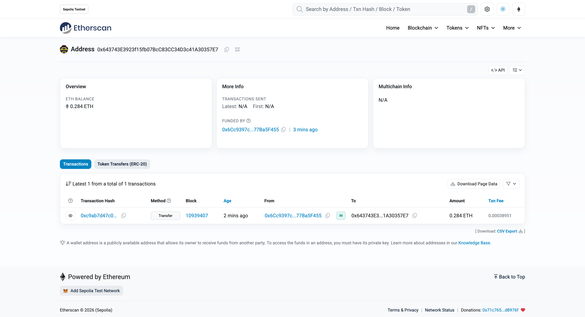
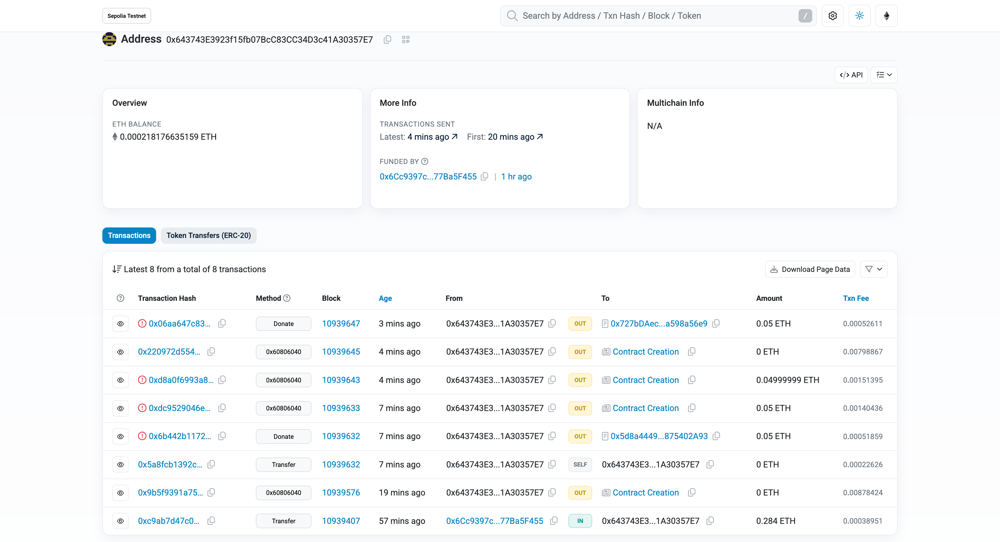

# Lab: Blockchain

**Name:** Robert Mesek  
**Lab:** 7  
**Date:** May 28, 2026

---

## Task 1



## Task 2

```solidity
// SPDX-License-Identifier: MIT
pragma solidity >=0.8.2 <0.9.0;

// Import Chainlink's AggregatorV3Interface to fetch real-world data
import {AggregatorV3Interface} from "@chainlink/contracts/src/v0.8/shared/interfaces/AggregatorV3Interface.sol";

contract DonationContract {
    // State variables
    address payable public owner;
    
    // Map address to stored value (keeping track of depositors)
    mapping(address => uint256) public identitiesToAmountFunded;

    // Chainlink Data Feed Interfaces
    AggregatorV3Interface internal ethUsdFeed;
    AggregatorV3Interface internal eurUsdFeed;

    // The constructor runs once when the contract is deployed
    constructor() {
        // The first person to deploy the contract is the owner
        owner = payable(msg.sender);

        // Initialize the two different interfaces for price feeds (Sepolia Testnet Addresses)
        // Note: Check chainlink docs for the most up-to-date Sepolia feed addresses
        ethUsdFeed = AggregatorV3Interface(0x694AA1769357215DE4FAC081bf1f309aDC325306); 
        eurUsdFeed = AggregatorV3Interface(0x1A81AFb8146AEFFCdC5E50ce46482eDcc2137ce2);
    }

    // Function to calculate the current ETH to EUR rate
    function getEthEurRate() public view returns (uint256) {
        (, int256 ethUsdPrice, , , ) = ethUsdFeed.latestRoundData();
        (, int256 eurUsdPrice, , , ) = eurUsdFeed.latestRoundData();

        // Calculate ETH/EUR price. Both USD feeds have 8 decimals, so they cancel out.
        // We multiply by 1e18 to maintain precision for Wei conversions.
        uint256 ethEurPrice = uint256((ethUsdPrice * 1e18) / eurUsdPrice);
        return ethEurPrice;
    }

    // Payable function to accept donations
    function donate() public payable {
        // Get the current ETH/EUR rate
        uint256 ethEurRate = getEthEurRate();
        
        // Calculate the value of the donation in Euros (with 18 decimal precision)
        uint256 donationValueInEur = (msg.value * ethEurRate) / 1e18;

        // Require minimum 1 Euro donation (represented as 1e18 because of decimals)
        require(donationValueInEur >= 1e18, "Minimum donation is 1 Euro");

        // Add entries to mapping to keep track of the depositors
        identitiesToAmountFunded[msg.sender] += msg.value;
    }

    // Function to withdraw funds
    function withdraw() public {
        // Allow withdraw only for contract creator
        require(msg.sender == owner, "Only the owner can withdraw funds");
        
        // Getting balance of the deployed contract
        uint256 contractBalance = address(this).balance;
        
        // Updated withdrawal method using call
        (bool success, ) = owner.call{value: contractBalance}("");
        require(success, "Transfer failed.");
    }
}
```

